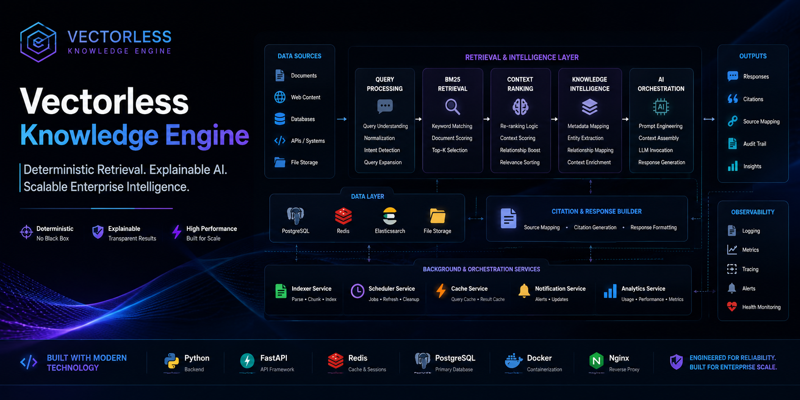
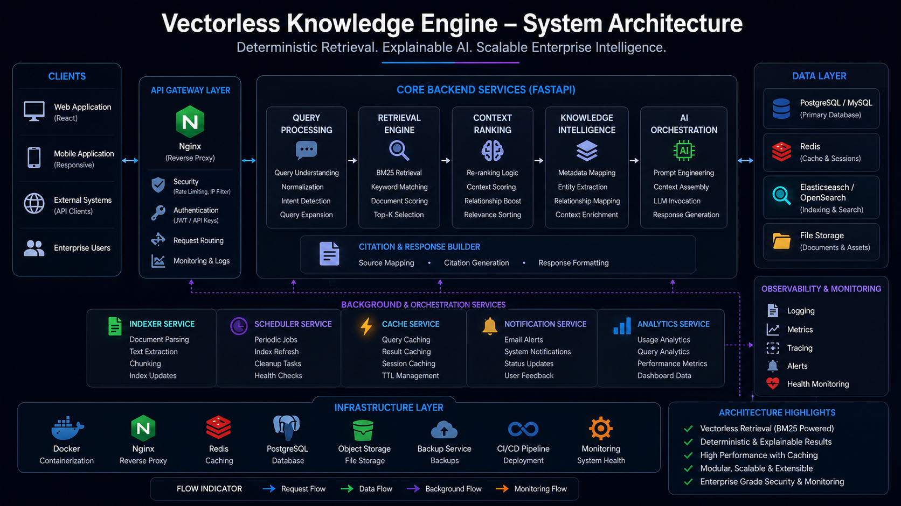
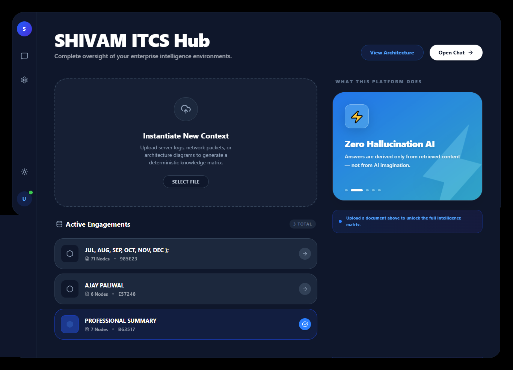
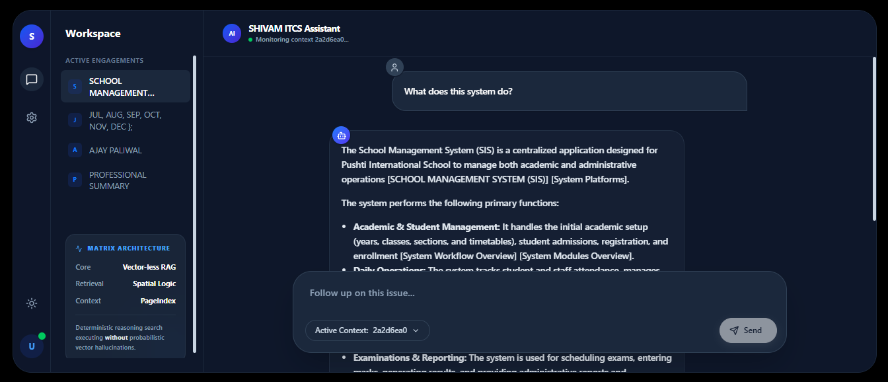
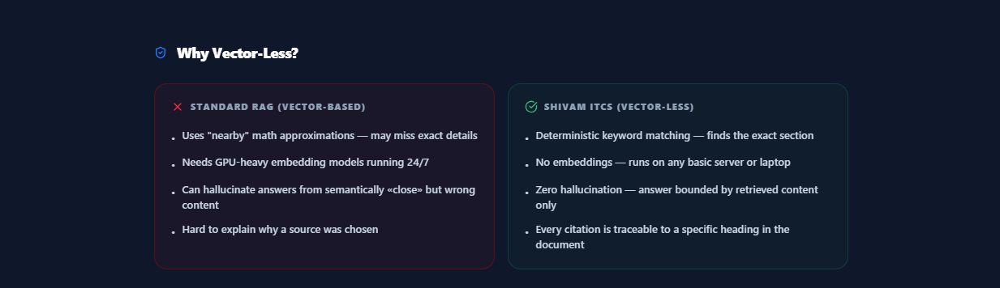

# Vectorless Knowledge Engine


 


Enterprise-grade vectorless retrieval platform engineered for deterministic knowledge orchestration, explainable AI search, contextual document intelligence, and scalable enterprise retrieval workflows without vector embeddings.

---

<p align="center">
  
</p>

--- 

## Platform Vision

Vectorless Knowledge Engine introduces a next-generation deterministic retrieval ecosystem designed for explainable AI workflows, contextual search orchestration, and scalable enterprise knowledge intelligence.

The platform combines BM25-powered retrieval pipelines, structured contextual ranking, SQL-driven orchestration, and AI-assisted response generation into a unified retrieval infrastructure without vector databases.

---

## Platform Highlights

- Deterministic retrieval workflows
- Explainable AI search infrastructure
- BM25-powered ranking engine
- Citation-aware response generation
- Contextual document intelligence
- Structured retrieval orchestration
- Enterprise workspace architecture
- Redis-powered caching workflows
- Scalable retrieval infrastructure
- Deterministic knowledge workflows

---

## Core Capabilities

- Document ingestion and indexing
- BM25-powered document retrieval
- Citation-aware AI responses
- Multi-source knowledge search
- Contextual query processing
- Redis-backed response caching
- Enterprise workspace management
- Explainable search results
- REST API integration
- Scalable retrieval infrastructure

---

## Business Problem

Traditional vector-based retrieval systems often introduce:
- expensive embedding infrastructure
- opaque ranking behavior
- difficult debugging workflows
- operational complexity
- resource-intensive retrieval infrastructure
- inconsistent contextual retrieval

Organizations require deterministic retrieval architectures capable of delivering explainable AI workflows, transparent contextual search, and scalable operational intelligence.

---

## Solution

Vectorless Knowledge Engine centralizes enterprise retrieval orchestration into a scalable contextual intelligence platform without relying on vector embeddings.

The platform enables:
- deterministic document retrieval
- contextual search orchestration
- AI-assisted response generation
- citation-aware workflows
- structured knowledge retrieval
- explainable ranking pipelines
- scalable enterprise search infrastructure

---

## Business Outcomes

Vectorless Knowledge Engine was designed to help organizations reduce retrieval complexity, improve contextual search transparency, and deliver explainable AI interactions across enterprise knowledge systems.

The platform enables teams to:
- eliminate embedding infrastructure overhead
- improve retrieval explainability
- reduce operational AI costs
- accelerate deployment workflows
- simplify contextual search orchestration
- deliver deterministic AI experiences

By focusing on structured retrieval intelligence instead of vector-heavy pipelines, the platform provides a more transparent, scalable, and operationally efficient enterprise AI architecture.

---

## Retrieval Capabilities

- Keyword and phrase search
- Context-aware ranking
- Source attribution
- Citation generation
- Knowledge mapping
- AI-assisted answer synthesis
- Structured retrieval workflows

---

## 🏗️ System Architecture

<p align="center">
  
</p>

Scalable vectorless retrieval architecture engineered for deterministic AI workflows, contextual knowledge orchestration, explainable document intelligence, and enterprise-grade retrieval infrastructure.

---

## Retrieval Workflow

```txt
User Query
    │
    ▼
Query Processing
    │
    ▼
BM25 Retrieval Engine
    │
    ▼
Context Ranking
    │
    ▼
Knowledge Mapping
    │
    ▼
AI Context Generation
    │
    ▼
Citation-Aware Response
```

---

## Product Experience

Modern enterprise retrieval workspace engineered for deterministic AI workflows, contextual document intelligence, and scalable knowledge orchestration.

---

### Enterprise Dashboard

<p align="center">
  
</p>

---

### AI Retrieval Workspace

<p align="center">
  
</p>

---

### Vectorless Retrieval Infrastructure

<p align="center">
  
</p>

---

## Key Use Cases

- Enterprise document search
- Internal knowledge assistants
- Compliance knowledge retrieval
- Research intelligence systems
- AI-powered support platforms
- Organizational knowledge discovery

---

## Technology Stack

### Backend Engineering
- Python
- FastAPI
- OpenAI APIs
- OpenRouter
- PostgreSQL
- MySQL
- Redis
- Elasticsearch
- OpenSearch

---

### Frontend Engineering
- React
- React Router
- Tailwind CSS
- Framer Motion
- Lucide Icons

---

### Infrastructure & Deployment
- Nginx
- Redis Caching
- REST API Infrastructure
- Modular Deployment Workflows
- Scalable Retrieval Pipelines

---

## Performance Engineering

- Deterministic retrieval workflows
- Optimized BM25 indexing
- Redis-powered caching
- Low-latency contextual search
- Scalable orchestration pipelines
- Modular infrastructure architecture

---

## Security Architecture

- Secure API infrastructure
- Protected retrieval endpoints
- Query validation workflows
- Role-based access control (RBAC)
- Infrastructure isolation

---

## Why Vectorless Retrieval

Traditional vector-based architectures require embedding generation, vector storage management, and infrastructure-heavy retrieval systems.

Vectorless Knowledge Engine focuses on:
- structured retrieval orchestration
- explainable AI workflows
- deterministic ranking behavior
- operational simplicity
- transparent contextual retrieval
- lower infrastructure complexity

This enables organizations to deploy scalable enterprise knowledge systems with predictable retrieval behavior and highly explainable AI interactions.

---

## Product Roadmap

### Phase 1 — Retrieval Infrastructure
- BM25 retrieval engine
- Structured indexing workflows
- Enterprise API infrastructure
- SQL-powered orchestration

---

### Phase 2 — Context Intelligence
- Citation-aware responses
- Contextual AI synthesis
- Knowledge relationship mapping
- Retrieval optimization

---

### Phase 3 — Enterprise Scaling
- Distributed retrieval workflows
- Multi-workspace orchestration
- Advanced analytics
- Operational intelligence systems

---

## Live Platform

🌐 https://rag.shivamitai.com/

Production-ready deterministic retrieval infrastructure for enterprise knowledge intelligence workflows.

---

## Repository Structure

```txt
/assets
   /screenshots
   /branding
   /architecture
   /workflows
```

---

## Repository Topics

```txt
vectorless-rag
deterministic-retrieval
enterprise-ai
knowledge-engine
document-intelligence
bm25
fastapi
react
postgresql
elasticsearch
opensearch
retrieval-system
context-engine
enterprise-search
knowledge-retrieval
bm25-search
document-search
ai-search
```

---

## License

MIT License

Copyright © 2026 SHIVAM ITCS
